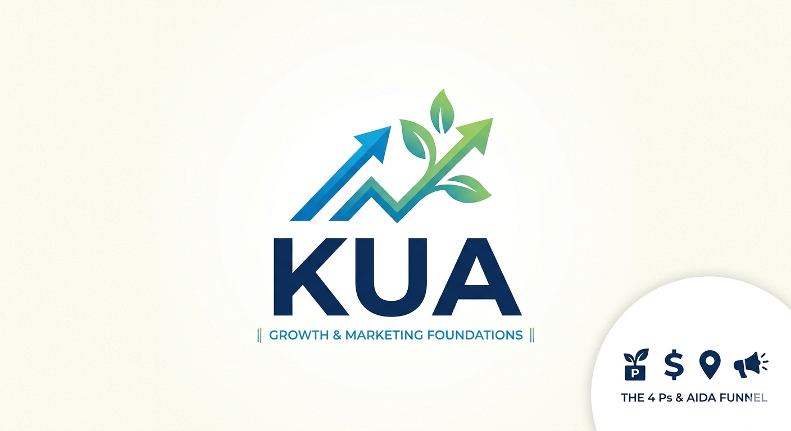

<p align="center">
  
</p>>

# Kua — Growth & Marketing Foundations

**Kua** is a premium, high-end educational platform designed to empower founders, entrepreneurs, and marketers with essential growth frameworks. From the **4 Ps** to the **AIDA funnel**, Kua provides a "zero-fluff" interactive learning experience.

---

## Features

*   **12 Core Modules**: Deep dives into Product, Price, Place, Promotion, SEO, and Content Strategy.
*   **Interactive AIDA Funnel**: A visualizer demonstrating the customer journey: Awareness, Interest, Desire, Action.
*   **Kua AI Companion**: An intelligent assistant capable of explaining complex marketing concepts and tracking user progress in real-time.
*   **Gamified Dashboard**: Track your learning progress, quiz averages, and daily streaks.
*   **Certification**: Automated certificate generation for Pro members upon 100% curriculum completion.

---

## Tech Stack

*   **Frontend**: HTML5, Tailwind CSS, and Iconify (Lucide set).
*   **Typography**: Inter (Google Fonts) for a modern, professional look.
*   **Logic**: Vanilla JavaScript with a modular "DB" handler for `localStorage` persistence.
*   **Animations**: Custom CSS keyframes for premium UI transitions like `fadeInUp` and `funnelFill`.

---

## Architecture

The platform is built as a highly optimized **Single Page Application (SPA)**:
*   **Routing**: Managed via a `showPg` function for seamless transitions between the Dashboard, Curriculum, and Quizzes.
*   **Data Structure**: Centralized constants (`MODS`, `QUIZZES`, `STATS`) for easy content scaling.
*   **Auth System**: Custom-built signup and login logic with role-based access control.
*   **Analytics**: Integrated tracking system (`Ana.t`) to log signups and module completions.

---

## Co-Founders

Kua is built and maintained by a dedicated team of innovators:

*   **Alimpa Anne Hillary**
*   **Egabo Aaron**
*   **Natozo Patience Martha**
*   **Niwasiima Ashelycole**
*   **Onyango John Steven**
*   **Rwothomio Evans . E.**

---

##  Getting Started

1.  **Clone the repository**:
    ```bash
    git clone https://github.com/EGABO-TECH/KUA.git
    ```
2.  **Open `index.html`**: Launch the file in any modern web browser.
3.  **Start Learning**: Navigate to the "Curriculum" tab to begin Module 1.

---

## Roadmap

*   **Teams Dashboard**: Collaborative tools for marketing agencies.
*   **1-on-1 Coaching**: Direct integration with industry mentors.
*   **Weekly Insights**: A dynamic marketing blog for trending growth hacks.

---
*© 2026 Kua Platform. Empowering the next generation of African entrepreneurs.*
