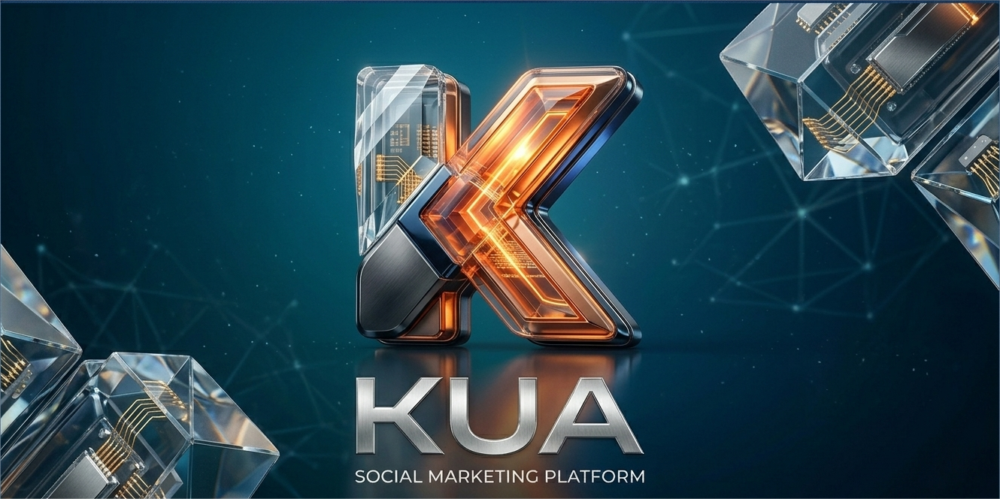

  
  
    
  
  
  
  
  
   
  
  <h1>KUA Social Marketing Platform</h1>
  
<strong>Your hyper-advanced social marketing command center.</strong>

---

##  Overview

**KUA** is a high-end, client-side Single Page Application (SPA) designed to serve as a comprehensive dashboard for creating, managing, and democratizing social marketing campaigns. 

Built with an ultra-premium "Clairon AI" dark-mode aesthetic featuring deep charcoal tones, electric orange accents, and volumetric CSS-based lighting, KUA provides lightning-fast marketing workflows directly from the browser window.

###  Core Features & Capabilities

- **Flyer Generator Engine**: Synthesize pixel-perfect campaign flyers via an HTML5 `<canvas>` rendering pipeline. Features drag-and-drop image uploading, dynamic typography layouts, and multiple automated theme layers (Classic, Midnight, Neon) for stunning promotional assets.
- **Multi-Channel Broadcast Center**: Actively manage a deployment grid to instantly distribute generated marketing content directly to connected node endpoints (WhatsApp, Instagram, X/Twitter, LinkedIn). Features an automated clipboard injection protocol for "paste-to-send" bypassing image upload ceilings.
- **Responsive Dynamic Architecture**: Leverages purely localized logic (`localStorage` telemetry) integrated into a 4-piece custom modular architecture (`index.html`, `app.js`, `styles.css`, `tailwind.config.js`). It is lightning-fast, caching user states continuously to persist sessions across workflows.
- **Cinematic Ambient Dashboard**: 
  - *SVG Ambient Geometry*: The application is completely wrapped using custom SVG geometric particle tracking elements overlaid onto the dashboard headers to create an ultra-modern 'tech engine' look without image-loading lag.
  - *Infinite Glass UI*: Immersive layered components boasting film-grain noise structures across floating cards, simulating depth.
- **Network Aggregation Hub**: A centralized command-auth center for rapidly tracking linked API tokens and external platforms, logging daily sync sessions via native timeline activity trackers. 

---

##  Tech Stack & Architecture

- **Markup & Layout**: Semantic HTML5, `index.html` orchestrating Tailwind CSS utility classes.
- **Business Logic Layer**: Vanilla JavaScript ES6 (`app.js`) handling dynamic routing (`nv()`), global state tracking (`P.page`), Data Persistence (`localStorage`), and HTML5 graphic synthesis.
- **Style Ecosystem**: Custom Tailwind CSS Config (`tailwind.config.js`) fused with advanced procedural CSS graphics (`styles.css`), implementing complex gradient-clip shadows and ambient volumetric glowing animations without using heavy frameworks like React or Next.js.

---

##  The Team

Designed, developed, and maintained by the brilliant core collaborators at **UNITED**:

- **Alimpa Anne Hillary**
- **Egabo Aaron**
- **Natozo Patience Martha**
- **Niwasiima Ashelycole**
- **Onyango John Steven**
- **Rwothomio Evans .E.**

---

  
<em>Built with vision. Engineered for scaling. Designed to convert.</em>

